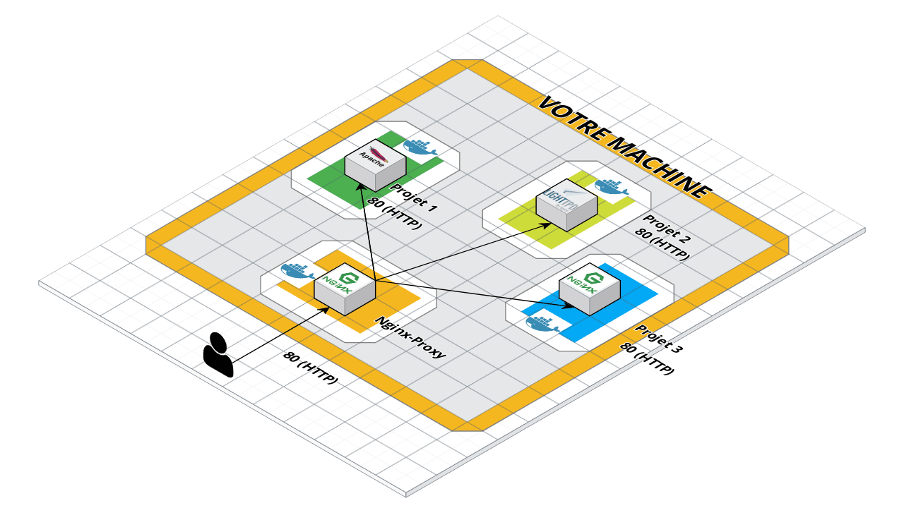

little project to help your project to use nginx-proxy.



nginx-proxy sets up a container running nginx and docker-gen. docker-gen generates reverse proxy configs for nginx and reloads nginx when containers are started and stopped.

See [jwilder/nginx-proxy repository](https://github.com/jwilder/nginx-proxy) for more informations.

# Install
Clone this repository in parent directory's of your project 
```shell script
$ mkdir -p [PROJECTS_DIRECTORY_PATH]/nginx-proxy && cd $_
$ wget -q https://github.com/benjy8001/raw/master/bin/installer -O -|bash
```

# HOW TO USE
### MANUAL CONFIGURATION

Add to your ~/.bashrc or ~/.zshrc 
```bash
export NGINX_PROXY=enabled
export NGINX_PROXY_DIRECTORY=[PROJECTS_DIRECTORY_PATH]/nginx-proxy
PATH=$PATH:$NGINX_PROXY_DIRECTORY/bin
```

### ACTIVATE OR NOT
define an environment variable to "enabled" or "disabled" usage of nginx-proxy.

```bash
$ export NGINX_PROXY=enabled
$ export NGINX_PROXY=disabled
```

or edit .env file

```dotenv
[...]
NGINX_PROXY=enabled
[...]
```

### UPDATE YOUR MAKEFILE

add lines in your Makefile and call label:


```makefile
require-nginx:
ifndef NGINX_PROXY_DIRECTORY
	printf " \033[31m  You should install nginx proxy ... \033[0m\n"
	printf " \n"
	printf " \033[31m cd ~/Projects && mkdir nginx-proxy && cd nginx-proxy \033[0m\n"
	printf " \033[31m wget -q https://github.com/benjy8001/nginx-proxy/raw/master/bin/installer -O -|bash \033[0m\n"
	printf " \n"
	exit 1
endif

start_nginx_proxy: 
ifeq (${NGINX_PROXY}, enabled)
	make require-nginx 
	nginx_proxy
endif

start: start_nginx_proxy
```


Example :

```makefile

include .env
export

require-nginx:
ifndef NGINX_PROXY_DIRECTORY
	printf " \033[31m  You should install nginx proxy ... \033[0m\n"
	printf " \n"
	printf " \033[31m cd ~/Projects && mkdir nginx-proxy && cd nginx-proxy \033[0m\n"
	printf " \033[31m wget -q https://github.com/benjy8001/raw/master/bin/installer -O -|bash \033[0m\n"
	printf " \n"
	exit 1
endif

start_nginx_proxy:
ifeq (${NGINX_PROXY}, enabled)
	make require-nginx 
	nginx_proxy
endif

registry_login: ## login on registry
registry_login:
	docker login babel.ngc-data.fr:8443

start-docker: ## Start the dockers
start-docker: registry_login start_nginx_proxy
	@docker-compose  up -d

start: ## alias of start-docker
start: start-docker

.DEFAULT_GOAL := help
help:
	@grep -E '(^[a-zA-Z_-]+:.*?## .*$$)|(^## )' $(MAKEFILE_LIST) | awk 'BEGIN {FS = ":?## "}; {printf "\033[32m%-30s\033[0m %s\n", $$1, $$2}' | sed -e 's/\[32m##/[33m/' | sed 's/Makefile.\(\s\)*//'
.PHONY: help

```

### UDPATE YOUR DOCKER-COMPOSE or DOCKER COMMAND

Then start any containers you want proxied with an env var `VIRTUAL_HOST=subdomain.youdomain.com`
```shell script
$ docker run -e VIRTUAL_HOST=foo.bar.com  ...
```
The containers being proxied must expose the port to be proxied, either by using the EXPOSE directive in their Dockerfile or by using the `--expose` flag to docker run or docker create.

Provided your DNS is setup to forward foo.bar.com to the host running nginx-proxy, the request will be routed to a container with the `VIRTUAL_HOST` env var set.

You can also define env vars in your `docker-compose.yml`

```yaml
version: "3.3"
services:
  api_httpd:
    image: nginx
    environment:
      VIRTUAL_HOST: subdomain.youdomain.com
      VIRTUAL_PORT: 80
```

### USE SSL 

#### Setup
To use ssl (https) you need to generate a local authority root certificate using this command :
```bash
nginx_proxy_ssl gen_authority
```
(you will need to generate a new certificate after expiration (2 years))

Then, make your web browser trust the root certificate (`docker/certs/AUTHORITY.crt`) as an authority (https://windowsreport.com/install-windows-10-root-certificates/).

#### Usage

You can add task to you Makefile

```Makefile


add-certificates: require-nginx
ifeq ("$(wildcard ${NGINX_PROXY_DIRECTORY}/docker/certs/my.domain.test.crt)","")
	echo "generating nginx proxy certs"
	nginx_proxy_ssl gen my.domain.test
	nginx_proxy restart
else
	echo "certs aldready added"
endif

start_nginx_proxy: add-certificates
	nginx_proxy
```